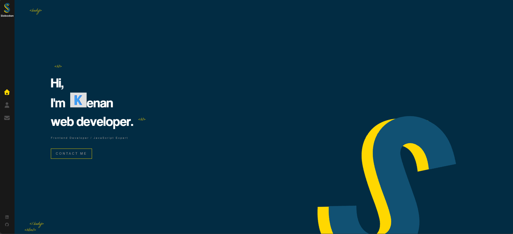
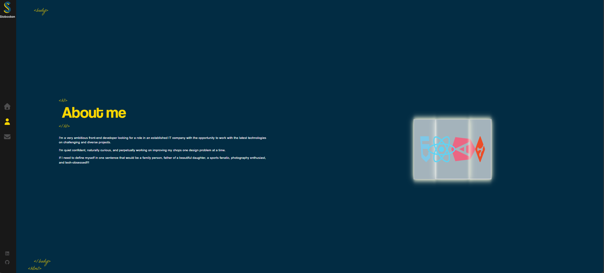
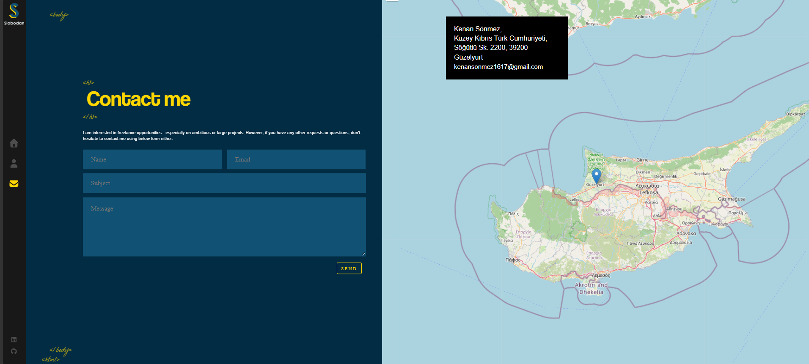
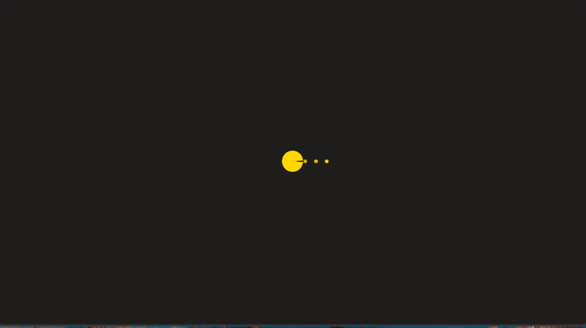

<h1 align="center">🎨 My Portfolio</h1>

React ve Vite kullanılarak geliştirilmiş, GSAP animasyonları, SCSS stilleri ve EmailJS iletişim formuyla donatılmış kişisel portfolyo websitesidir.

<h2>📌 Proje Amacı</h2>

Bu proje, modern front-end teknolojilerini pratikte uygulamak ve kişisel portfolyo olarak kullanmak amacıyla geliştirilmiştir.
React bileşen mimarisi, GSAP ile sayfa geçiş animasyonları, EmailJS ile backend gerektirmeden çalışan iletişim formu ve
React Leaflet ile interaktif harita gibi özellikleri bir araya getirmektedir.

<ul>
<li>GSAP ile harf harf animasyonlu başlıklar ve sayfa geçişleri</li>
<li>React Router DOM ile çok sayfalı SPA navigasyon yapısı</li>
<li>FontAwesome ikonları ile zenginleştirilmiş sidebar navigasyonu</li>
<li>EmailJS entegrasyonu ile doğrudan e-posta gönderimi</li>
<li>React Leaflet ile interaktif konum haritası</li>
<li>React Spinners ile yükleme ekranı</li>
<li>Animate.css ve GSAP ile akıcı giriş animasyonları</li>
<li>SCSS ile modüler ve özelleştirilmiş stil yönetimi</li>
<li>Özel fontlar (CoolveticaRg, LaBelleAurore, Helvetica Neue)</li>
</ul>

<h2>🛠️ Kullanılan Teknolojiler</h2>

<ul>
<li>React 19</li>
<li>Vite 8</li>
<li>React Router DOM v7</li>
<li>GSAP (gsap-trial)</li>
<li>Animate.css</li>
<li>SCSS (sass-embedded)</li>
<li>FontAwesome (free-brands + free-solid)</li>
<li>@emailjs/browser</li>
<li>React Leaflet</li>
<li>React Spinners</li>
<li>ESLint + Prettier</li>
</ul>

<h2>✨ Öne Çıkan Özellikler</h2>

<ul>
<li>AnimatedLetters bileşeni ile her harfe ayrı GSAP animasyonu</li>
<li>Sidebar navigasyon ile sayfalar arası geçiş</li>
<li>Logo animasyonu (SVG tabanlı çizgi efekti)</li>
<li>Hakkımda (About) sayfasında beceri ve deneyim bilgileri</li>
<li>İletişim (Contact) sayfasında EmailJS ile form gönderimi ve Leaflet haritası</li>
<li>Sayfa yüklenirken spinner gösterimi</li>
<li>Özel font entegrasyonu ile kişiselleştirilmiş tipografi</li>
<li>Responsive ve modern kullanıcı arayüzü</li>
</ul>

<h2>📂 Proje Yapısı</h2>

<pre>
my-portfolio/
│
├── public/
│
├── src/
│   ├── assets/
│   │   ├── fonts/
│   │   │   ├── CoolveticaRg-Regular.woff
│   │   │   ├── CoolveticaRg-Regular.woff2
│   │   │   ├── helvetica-neu.ttf
│   │   │   ├── LaBelleAurore.woff
│   │   │   └── LaBelleAurore.woff2
│   │   └── images/
│   │       ├── k.jpg
│   │       ├── logo_sub.png
│   │       ├── logo-lines-2.svg
│   │       ├── logo-lines.svg
│   │       ├── logo-s.png
│   │       ├── logo1.png
│   │       ├── logo2.png
│   │       ├── logo3.png
│   │       ├── logo4.png
│   │       └── logopreload.png
│   │
│   ├── components/
│   │   ├── About/
│   │   │   ├── index.jsx
│   │   │   └── index.scss
│   │   ├── AnimatedLetters/
│   │   │   ├── index.jsx
│   │   │   └── index.scss
│   │   ├── Contact/
│   │   │   ├── index.jsx
│   │   │   └── index.scss
│   │   ├── Home/
│   │   │   ├── Logo/
│   │   │   │   ├── index.jsx
│   │   │   │   └── index.scss
│   │   │   ├── index.jsx
│   │   │   └── index.scss
│   │   ├── Layout/
│   │   │   ├── index.jsx
│   │   │   └── index.scss
│   │   └── Sidebar/
│   │       ├── index.jsx
│   │       └── index.scss
│   │
│   ├── App.jsx
│   ├── App.scss
│   ├── index.css
│   └── main.jsx
│
├── image.gif
├── image1.png
├── image2.png
├── image3.png
├── .env
├── .gitignore
├── .prettierrc
├── eslint.config.js
├── index.html
├── package-lock.json
├── package.json
└── vite.config.js
</pre>

<h2>📸 Proje Önizleme</h2>

<h2>🎥 Demo (GIF)</h2>

<h2>🚀 Kurulum</h2>

Projeyi klonlayın:

<pre>
git clone https://github.com/kenansonmez1617-hub/my-portfolio.git
</pre>

Proje klasörüne girin:

<pre>
cd my-portfolio
</pre>

Bağımlılıkları yükleyin:

<pre>
npm install
</pre>

EmailJS için <code>.env</code> dosyasını düzenleyin:

<pre>
VITE_EMAILJS_SERVICE_ID=your_service_id
VITE_EMAILJS_TEMPLATE_ID=your_template_id
VITE_EMAILJS_PUBLIC_KEY=your_public_key
</pre>

Projeyi çalıştırın:

<pre>
npm run dev
</pre>

<h2>🔮 Geliştirilebilir Özellikler</h2>

<ul>
<li>Portföy / Projeler sayfası eklenmesi</li>
<li>Karanlık / aydınlık tema (dark / light mode) desteği</li>
<li>Blog veya yazı bölümü</li>
<li>Form doğrulama (validation) geliştirmeleri</li>
<li>Dil desteği (Türkçe / İngilizce i18n)</li>
<li>Unit testler ile test coverage</li>
</ul>

<h2>👨‍💻 Geliştirici</h2>

<strong>Kenan Sönmez</strong> 
Frontend Developer

GitHub: 
<a href="https://github.com/kenansonmez1617-hub" target="_blank">
https://github.com/KULLANICI_ADINIZ
</a>

LinkedIn: 
<a href="https://www.linkedin.com/in/kenan-sonmez" target="_blank">
https://www.linkedin.com/in/KULLANICI_ADINIZ
</a>

<h2>📄 Lisans</h2>

Bu proje eğitim ve portfolyo amaçlı geliştirilmiştir.
İncelenebilir ve geliştirilebilir.

⭐ Projeyi beğendiyseniz GitHub üzerinden yıldız bırakabilirsiniz.

